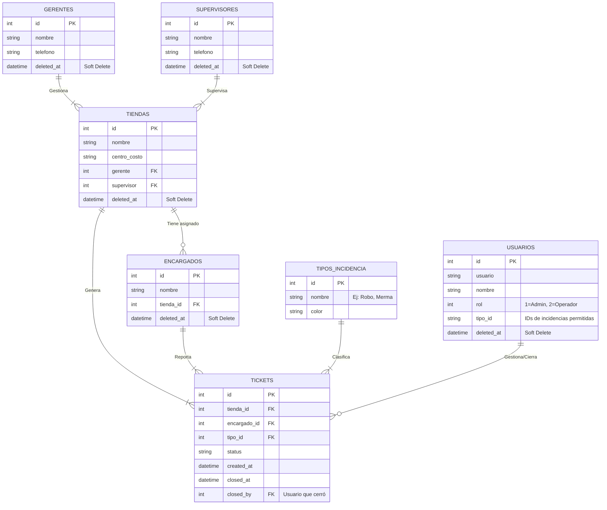
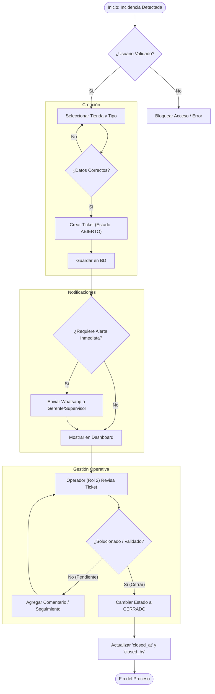
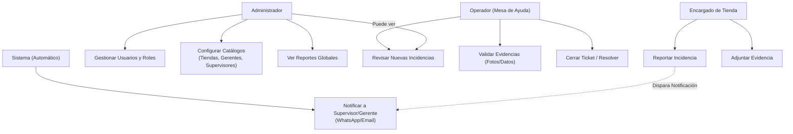

# Documentación Visual del Proyecto

## 1. Diagrama Entidad-Relación (ER)
*Describe la estructura de la base de datos y cómo se conectan las tablas.*

## 2. Diagrama de Flujo (Ciclo de Vida de Incidencia)
*Explica el proceso operativo desde que se detecta una incidencia hasta que se cierra.*

## 3. Diagrama de Casos de Uso (Funcional)
*Define los roles y sus permisos. Ideal para explicar el sistema a clientes o usuarios finales.*

